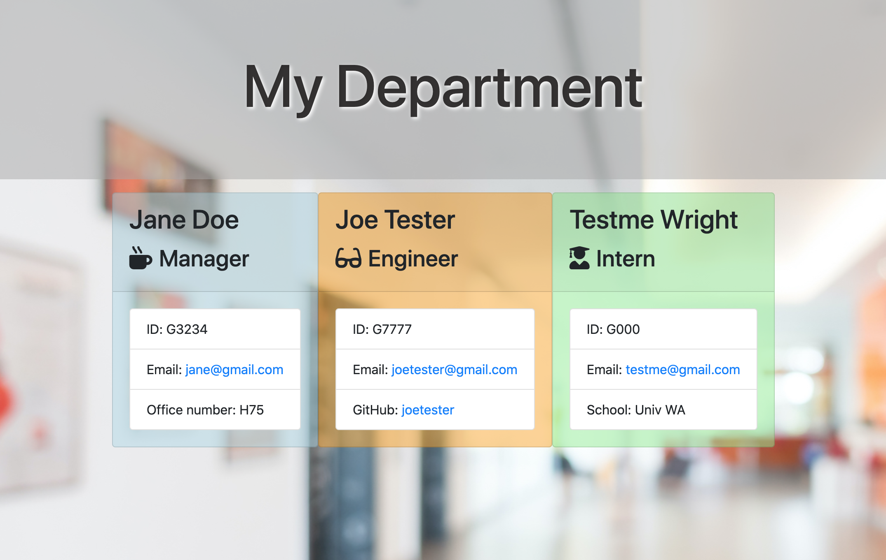

# CLI.TeamGenerator.Template.Engine

[](https://opensource.org/licenses/MIT)
      
     
## Description

A Node CLI that takes in information about employees and generates an HTML webpage that displays summaries for each person.  This solves the issues of spending additional time formatting the information for each employee.

## Table of Contents
 
* [Installation](#installation)
* [Usage](#usage)  
* [Credits](#credits)
* [License](#license)
 
## Installation
```
npm install
``` 

## Usage

Watch the CLI TeamGenerator demo [here.](https://vimeo.com/477902553/43a74d6bde)  
Access the project repository [here.](https://github.com/lee-amber-alex/CLI.TeamGenerator.Template.Engine)   

#### Application output


## Credits
Background image provided by [freepik.](https://www.freepik.com/)

## License
This project is covered under the MIT License.
 
## Tests
```
npm test
``` 

## Questions
- [Email](lee.amber.alex@gmail.com)
- [Github Page](https://github.com/lee-amber-alex)
 
